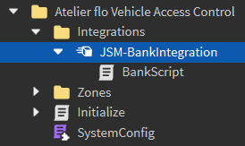

# Setup for Card Reader Pro


This setup guide is only for flo Vehicle Access Control V2.2 and above.


## Integrations

flo Card Reader Pro uses Atelier Group's new card reader, Atelier ReaderPlus. ReaderPlus is currently only compatible with 3 types of cards and will be compatible with even more cards soon.

### JSM Debit Cards

Charge players whenever they tap a JSM Debit Card at a ReaderPlus device.

1.  Locate the JSM-BankIntegration `BindableFunction` in the **Integrations** folder.\


    <figure><figcaption></figcaption></figure>
2. Open BankScript and you will find this function.\


```lua
function Network.OnInvoke(User,Amount)
	--[[
	Function will send the following information:
	---------------------------------------------
	User - Player Object
	Amount - Number Value
	]]--
	
	return true -- returns if the payment should be accepted
end
```

3. Add your custom code into the function and return `true` or `false` depending on whether ReaderPlus should accept the transaction.
4. You can customize the amount charged in `README_Config` which you can find in the ReaderPlus model.

### Indirecta NFC Cards

An pre-setup Indirecta NFC card has already been provided in the file.

To make an Indirecta NFC card compatible with ReaderPlus, the card's NFC string should be `R=_jB.xN02` and encrypted with the Handle's Size property.

**Example:**

```lua
local data = enc("R=_jB.xN02", part.Size)
_conn = v.OnClientEvent:Connect(function()
	v:FireServer(data, part)
end)
```

### HKS1 Access Cards (a.k.a DWProx)

HKS1 Access Cards, more popularly known as DWProx cards are also compatible with ReaderPlus.

You can customize which access levels should be accepted in `README_Config` which you can find in the ReaderPlus model.
