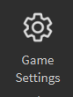

# 🙋 The Basics

## Enabling HTTP requests

All products require HTTP requests to be enabled for license checking. Disabling HTTP requests does not allow you to bypass license checks, but instead your products will self-destruct.

Follow the step-by-step guide below to learn howto enable HTTP requests in your game.

1.  Open Game Settings from the Ribbon.\

    <figure><figcaption></figcaption></figure>
2.  Go to the Security tab.\

    <figure><figcaption>
The Basic Info tab in Game Settings.
</figcaption></figure>
3.  Enable "Allow HTTP Requests".\

    <figure><figcaption></figcaption></figure>

4. Click Save at the bottom right of the Game Settings window, and you're done!

## Script Capabilities


This section is only for those who have designated any `Model`, `Folder`, or `Script` as a sandboxed container in their **scripted** product. For more information, please [click here](https://create.roblox.com/docs/scripting/capabilities).


For every sandboxed container, here are some capabilities that we highly recommend allowing to ensure that your product can function correctly.

### Execution Control

* RunClientScript - [`LocalScript`](https://create.roblox.com/docs/reference/engine/classes/LocalScript) or [`Script`](https://create.roblox.com/docs/reference/engine/classes/Script) with a [`RunContext`](https://create.roblox.com/docs/reference/engine/classes/BaseScript#RunContext) value of [`Client`](https://create.roblox.com/docs/reference/engine/enums/RunContext#Client) is allowed to execute on the client
* RunServerScript - [`Script`](https://create.roblox.com/docs/reference/engine/classes/Script) with a [`RunContext`](https://create.roblox.com/docs/reference/engine/classes/BaseScript#RunContext) value of [`Server`](https://create.roblox.com/docs/reference/engine/enums/RunContext#Server) is allowed to execute on the server

### Instance Access Control

* AccessOutsideWrite - Script is allowed to fetch and receive instances from outside the sandboxed container

### Script Functionality Control

* AssetRequire - Script is allowed to call [`require`](https://create.roblox.com/docs/reference/engine/globals/LuaGlobals#require) with an asset ID
* CreateInstances - Script can create new instances using [`Instance.new`](https://create.roblox.com/docs/reference/engine/datatypes/Instance#new), [`Instance.fromExisting`](https://create.roblox.com/docs/reference/engine/datatypes/Instance#fromExisting), or [`Instance:Clone()`](https://create.roblox.com/docs/reference/engine/classes/Instance#Clone)

### Engine API Access Control

* Basic - Access to simple instances and essential building blocks
* Audio - Access to instances related to audio APIs
* Network - Access to HTTP networking APIs
* Physics - Access to instances related to physics
* UI - Access to instances related to user interfaces
* Environment - Access to instances related to the control of how the environment is displayed
* RemoteEvent - Access to instances for internal networking operations
